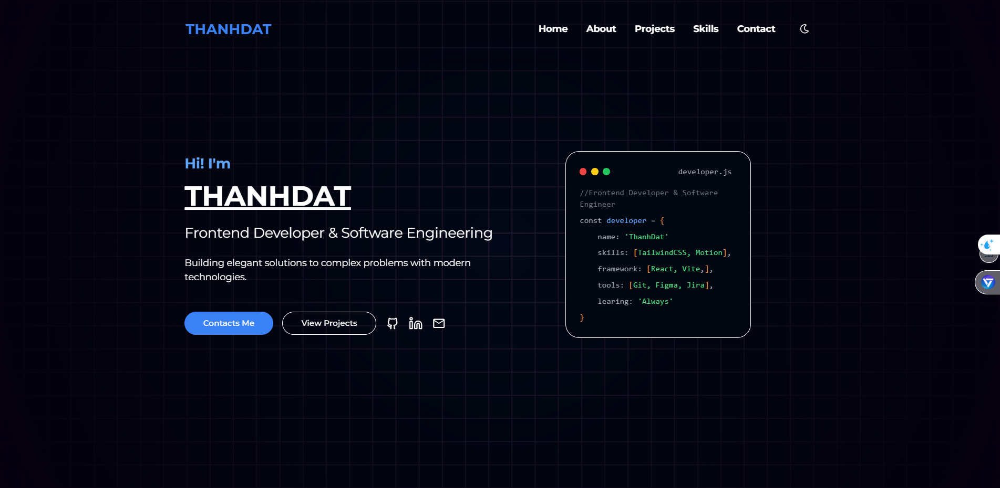
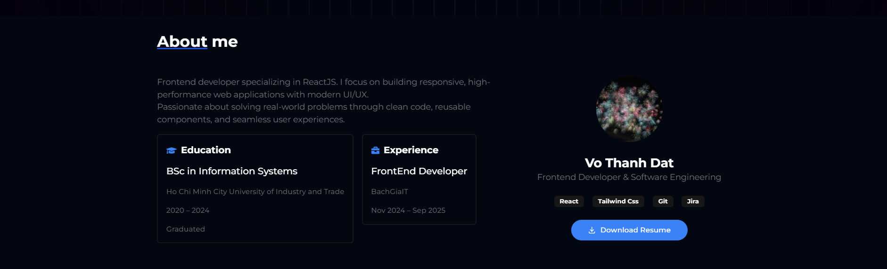
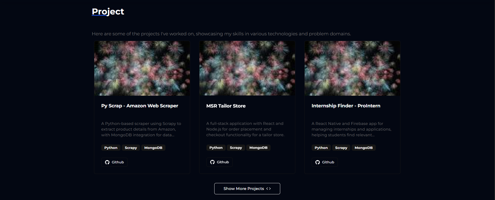
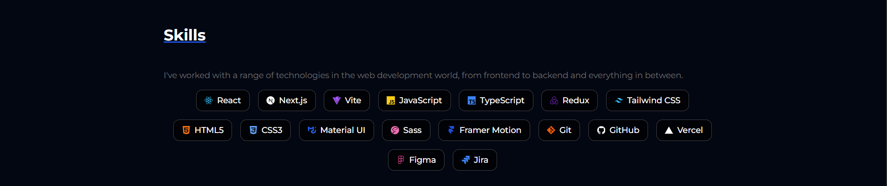
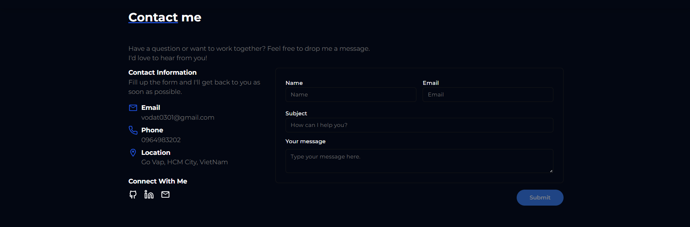

# Portfolio

> A modern personal portfolio to showcase my profile, skills, and projects – built to impress recruiters and employers.

---

## 🖼️ Screenshots

### 1. Homepage



---

### 2. About Me



---

### 3. Projects



---

### 4. Skills



---

### 5. Contact Me



---

## 🚀 Demo

<!-- Add your deploy link here when ready -->
[Live Demo](https://portfolio-ruddy-omega-17.vercel.app/)

---

## ✨ Features

- ⚡️ **Animated Scroll Effects** (Framer Motion)
- 🌗 **Dark Mode**
- 📱 **Responsive Design**
- 🗂️ **Project & Skills Showcase**
- ✉️ **Contact Section** (email integration)

---

## 🛠️ Tech Stack

- [React](https://react.dev/)
- [Vite](https://vitejs.dev/)
- [Tailwind CSS](https://tailwindcss.com/)
- [Framer Motion](https://www.framer.com/motion/)
- [Shadcn UI](https://ui.shadcn.com/)

---

## 🧑‍💻 Author

**Vo Thanh Dat**

- Email: [vodat0301@gmail.com](mailto:vodat0301@gmail.com)

---

## 📦 Getting Started

```bash
# Clone this repo
git clone https://github.com/your-username/your-portfolio.git
cd your-portfolio

# Install dependencies
npm install

# Start dev server
npm run dev
